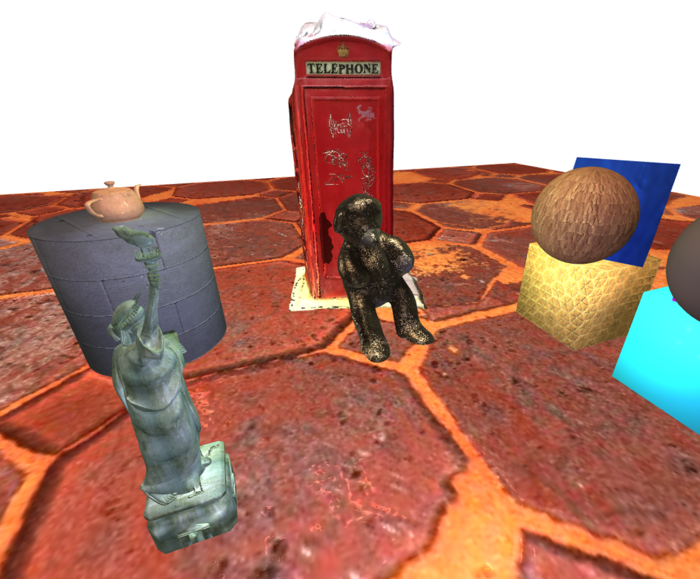
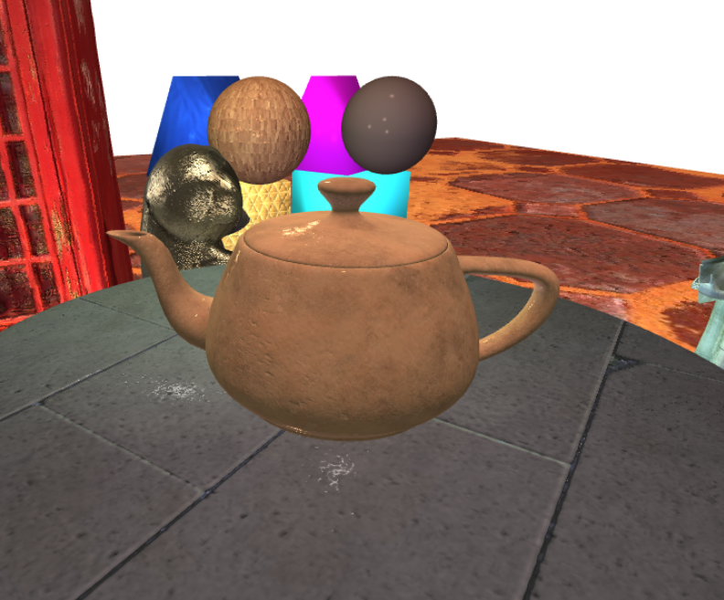
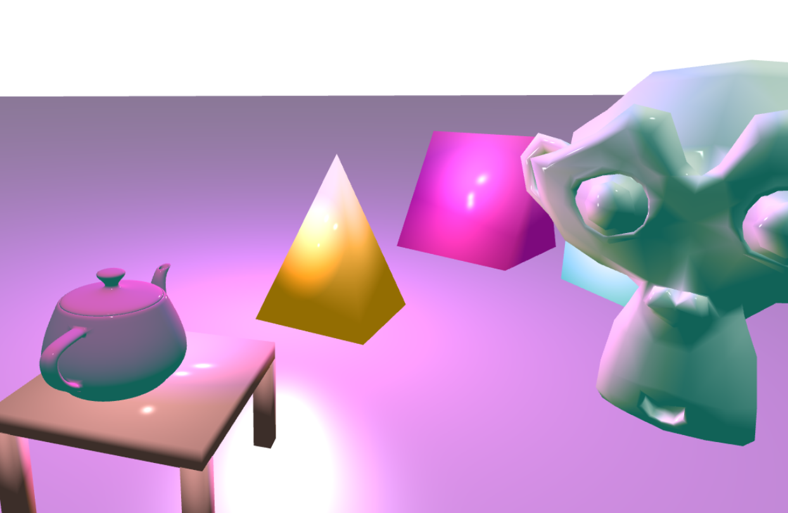
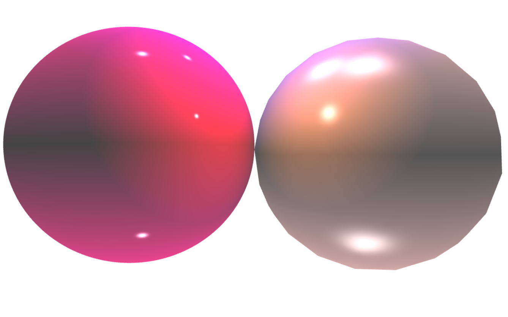

# Assignment 5 ecs 175

### controls:

number keys change shader  
**r** for ray cast mode  
**q** to cycle through lights  
**p** and o change projection  
use **l** to toggle translation of lights with scene
use **f** to switch between texture filtering methods

#### standard controls:

_left click_ hold move around scene  
_right click_ hold zoom  

#### ray cast controls:

_left click_ for rotation  
_right click_ for translation  
_middle click_ for scale  
selecting an object in raycast mode also enables the material properties to be changed 
